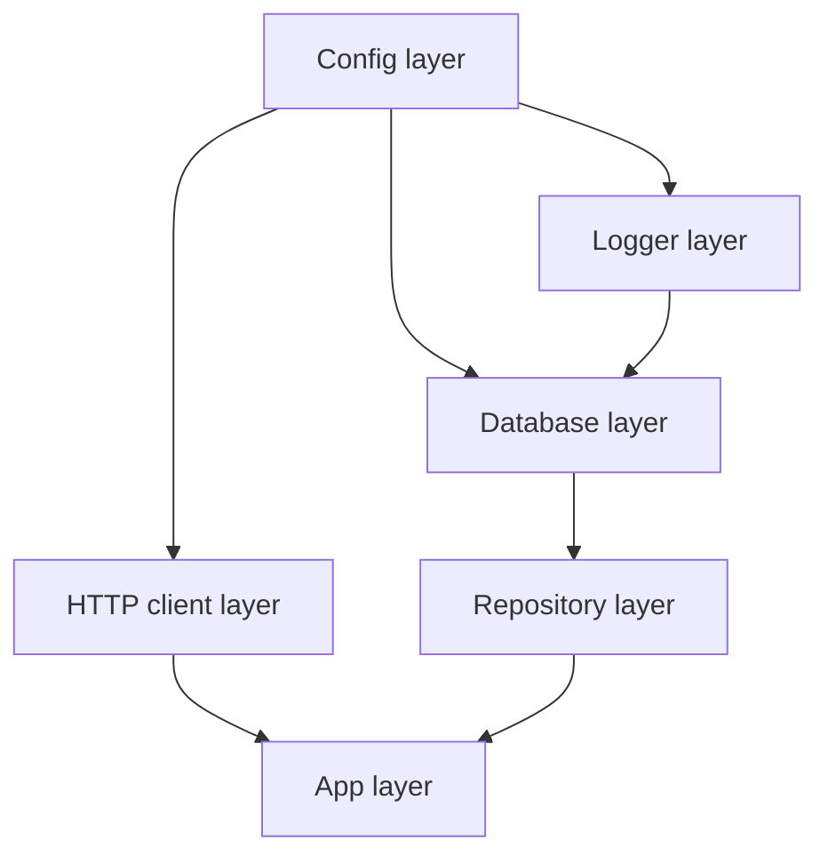
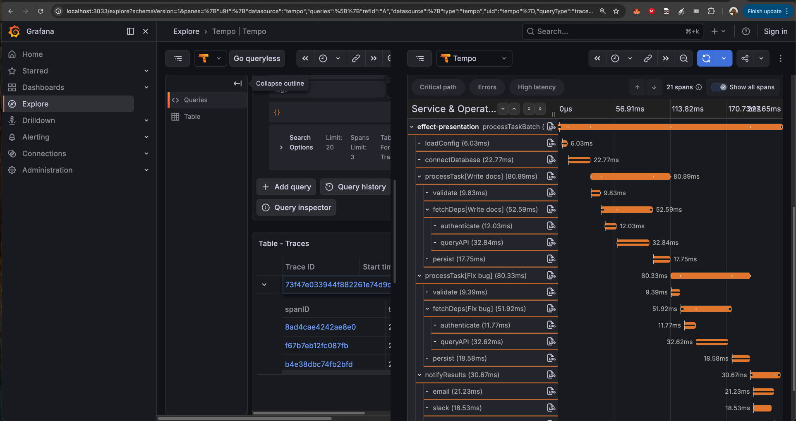

# Effect-TS

### The missing typescript standard library

- error handling
- dependency injection
- structured concurrency
- resource management
- numerous other QOL features
- all that composable with each other

---

## Effect?

```
Effect<Success, Error, Requirements>
          |        |         |
          |        |         +-- what this code needs 
          |        +------------ expected errors it can produce
          +---------------------- happy path value
```

- description of work
- typically runs at program edge

```typescript
Effect.runPromise(program)
```

- can be seen as `(rs: Requirements) => Promise<() => {error: Error} | {success: Success}>`

---

```typescript
// plain ts example
async function firstIssueTitle(projectId: string): Promise<string> {
  const response = await fetch(`/projects/${projectId}/issues`)
  const data = await response.json()
  return data.items[0].title
}
```


---

## What do callers see?

Plain TS:

```typescript
firstIssueTitle:
  (projectId: string) => Promise<string>
```

Effect:

```typescript
firstIssueTitle:
  (projectId: ProjectId) =>
    Effect<string, HttpClientError | ParseError | NoIssuesFound, HttpClient>
```

- `Promise<string>`: success shape only
- `Effect<string, HttpClientError | ParseError | NoIssuesFound, HttpClient>`: success + failure + requirement

---

## Where did the cognitive load go?

```typescript
async function firstIssueTitle(projectId: string): Promise<string> {
  const response = await fetch(`/projects/${projectId}/issues`)
  const data = await response.json()
  return data.items[0].title
}
```

- HTTP can fail
- JSON may not match the expected shape
- `items` may be missing or empty
- `title` may not be a string


---

## Rewritten: setup

```typescript
const ProjectId = Schema.String.pipe(Schema.brand("ProjectId"))
type ProjectId = typeof ProjectId.Type

const ProjectIssues = Schema.Struct({
  items: Schema.Array(Schema.Struct({
    title: Schema.String,
  })),
})

class NoIssuesFound extends Schema.TaggedError<NoIssuesFound>()(
  "NoIssuesFound",
  { projectId: ProjectId }
) {}
```

---

## Rewritten

```typescript
const firstIssueTitle =
  (projectId: ProjectId) =>
    Effect.gen(function* () {
      const response =
        yield* HttpClient.get(`/projects/${projectId}/issues`)

      yield* HttpClientResponse.filterStatusOk(response)

      const data =
        yield* HttpClientResponse.schemaBodyJson(ProjectIssues)(response)

      const first = data.items[0]
      if (!first) return yield* Effect.fail(new NoIssuesFound({ projectId }))

      return first.title
    })

// Effect<string, HttpClientError | ParseError | NoIssuesFound, HttpClient>
```

---

## Bigger example: ingestion in TS

```typescript
async function ingestBatch(urls: string[]): Promise<IngestSummary> {
  const pages = await Promise.all(
    urls.map((url) => fetch(url).then((r) => r.text()))
  )

  const records = pages.flatMap(extractRecords)
  await saveRecords(records)
  console.log(`ingested: ${records.length}`)
  return summarize(records)
}
```

- retry?
- concurrency limit?
- validation?
- partial failure?
- persistence errors?
- trace?
- cancellation?
- timeout?

---

## Bigger example: TS with those concerns

<div class="small">

```typescript
async function ingestBatch(urls: string[], signal: AbortSignal): Promise<IngestResult> {
  const timeout = AbortSignal.timeout(10_000)
  const combined = AbortSignal.any([signal, timeout])
  const span = tracer.startSpan("ingestBatch")
  try {
    const pages = await pLimit(8).map(
      urls,
      (url) => retry(() => fetchText(url, combined), 3)
    )

    const parsed = SourceRecords.safeParse(pages.flatMap(extractRecords))
    if (!parsed.success) return { ok: false, error: "InvalidRecords" }
    combined.throwIfAborted()

    await saveRecords(parsed.data, combined)
    console.log(`ingested: ${parsed.data.length}`)
    span.setStatus({ code: SpanStatusCode.OK })
    return { ok: true, summary: summarize(parsed.data) }
  } catch (error) {
    span.recordException(error)
    return { ok: false, error: classify(error) }
  } finally {
    span.end()
  }
}
```

</div>

---

## Bigger example: ingestion in Effect

```typescript
const retryPolicy =
  Schedule.exponential(Duration.millis(100)).pipe(
    Schedule.compose(Schedule.recurs(3))
  )

const ingestBatch = (urls: ReadonlyArray<SourceUrl>) =>
  Effect.gen(function* () {
    const pages = yield* Effect.all(
      urls.map((url) => fetchText(url).pipe(
        Effect.retry(retryPolicy)
      )),
      { concurrency: 8 }
    )

    const records = yield* Schema.decodeUnknown(SourceRecords)(
      pages.flatMap(extractRecords)
    )
    yield* saveRecords(records)
    return summarize(records)
  }).pipe(
    Effect.timeoutFail({
      duration: Duration.seconds(10),
      onTimeout: () => new IngestError({ reason: "Timeout" }),
    }),
    Effect.tap((summary) => Effect.logInfo(`ingested: ${summary.count}`)),
    Effect.withSpan("ingestBatch")
  )
```

---

## Bigger example: caller view

```typescript
ingestBatch:
  (urls: ReadonlyArray<SourceUrl>) =>
    Effect<
      IngestSummary,
      HttpError | ParseError | DbError | IngestError,
      HttpClient | RecordRepository
    >
```

---

# Problem 1

## "What can this throw?"

`pnpm run 01`

---

## The classic code hides the contract

```typescript
async function fetchTask(id: string): Promise<Task> {
  const row = await db.get(id)
  if (!row) throw new Error("not found")
  return row
}

async function startTask(id: string): Promise<Task> {
  const task = await fetchTask(id)
  if (task.status !== "pending") throw new Error("bad status")
  return db.update(id, { status: "running" })
}
```

- visible: `Promise<Task>`
- hidden: `not found`
- hidden: `bad status`

---

## Effect puts failures in the type

```typescript
fetchTask:
  (id: string) => Effect<Task, TaskNotFoundError>

startTask:
  (id: string) =>
    Effect<Task, TaskNotFoundError | InvalidStatusError>
```

---

## Errors are domain values

```typescript
class TaskNotFoundError extends Schema.TaggedError<TaskNotFoundError>()(
  "TaskNotFoundError",
  { id: Schema.String }
) {
  get message() {
    return `Task '${this.id}' not found`
  }
}
```

---

## Handle one problem, leave the rest visible

```typescript
const result = yield* startTask("missing").pipe(
  Effect.catchTag("TaskNotFoundError", (e) =>
    createTask({ id: e.id, title: "Untitled" })
  )
)

// Before: Effect<Task, TaskNotFoundError | InvalidStatusError>
// After:  Effect<Task, InvalidStatusError>
```

- remaining error: `InvalidStatusError`

---

# Problem 2

## "My tests need a real service"

`pnpm run 02` | `pnpm test`

---

## The pain

- start a database
- seed it in the correct order
- configure a fake API key
- avoid conflicting ports
- clean up after a failed run
- hope nobody else changed staging state
- how to run many worktrees coding agent harnesses in parallel?

---

## Define what you need, not where it comes from

```typescript
type TaskId = string
type TaskStatus = "pending" | "running" | "done" | "failed"

class TaskRepository extends Context.Tag("TaskRepository")<
  TaskRepository,
  {
    readonly fetchById:
      (id: TaskId) => Effect<Task, TaskNotFoundError>
    readonly updateStatus:
      (id: TaskId, status: TaskStatus) =>
        Effect<Task, TaskNotFoundError>
  }
>() {}
```

- interface as value

---

## Business logic asks for the service

```typescript
const startTask = (id: TaskId) =>
  // Effect<Task, TaskNotFoundError | InvalidStatusError, TaskRepository>
  Effect.gen(function* () {
    const repo = yield* TaskRepository
    const task = yield* repo.fetchById(id)

    if (task.status !== "pending") {
      return yield* Effect.fail(new InvalidStatusError({
        id,
        current: task.status,
        expected: "pending",
      }))
    }

    return yield* repo.updateStatus(id, "running")
  })
```

- no constructor plumbing
- no global singleton
- no hidden import

---

## Provide the implementation at the edge

```typescript
const main = startTask("1").pipe(
  Effect.tap((task) => Effect.log(`Started: ${task.title}`)),
  Effect.provideService(TaskRepository, inMemoryRepo)
)
```

- before: requires `TaskRepository`
- after: requirement satisfied

---

## Layer: package the implementation

```typescript
const TaskRepositoryTest =
  Layer.succeed(TaskRepository, testRepo)

const result = startTask("1").pipe(
  Effect.provide(TaskRepositoryTest)
)
```

- one service: `provideService`
- app graph: `Layer`

---

## Layer dependency graph



- `Effect.provide(AppLayer)`

---

## Swappable layer combinations

```
                    same program
                         |
      +----------+-------+-------+----------+
      |          |               |          |
   prod app   staging app      local app   test app
      |          |               |          |
HttpClient  HttpClient      in-memory   in-memory
ExternalAPI ExternalAPI     fake APIs    fake APIs
Telemetry   Telemetry       console     disabled
LLM         sandbox LLM     fake LLM    fake LLM
Database    staging DB      SQLite      in-memory
Cache       staging cache   local cache in-memory
```

- any service can move independently
- production service + fake LLM
- real HTTP + in-memory database
- disabled telemetry + real cache

---

## Plain TS mock

```typescript
jest.mock("./TaskRepository", () => ({
  fetchById: jest.fn(),
  updateStatus: jest.fn(),
}))

beforeEach(() => {
  jest.resetAllMocks()
  mocked(fetchById).mockResolvedValue(mockTask)
  mocked(updateStatus).mockResolvedValue({ ...mockTask, status: "running" })
})
```

---

## Effect test implementation

```typescript
const testRepo = TaskRepository.of({
  fetchById: (id) =>
    id === "1"
      ? Effect.succeed(mockTask)
      : Effect.fail(new TaskNotFoundError({ id })),

  updateStatus: (_id, status) =>
    Effect.succeed({ ...mockTask, status }),
})
```

---

## This is the bridge to parallel work

```
shared staging
      |
      v
serial feedback loop

worktree A + isolated in-memory state + test layer
worktree B + isolated in-memory state + test layer
worktree C + isolated in-memory state + test layer
      |
      v
parallel feedback loops
```

- every worktree can provide its own in-memory repository
- same fixtures, isolated state
- more feature work can get fast local feedback

---

# Problem 3

## "Time made my test flaky"

`pnpm run 03` | `pnpm test`

---

## Date.now() is a global dependency

```typescript
function assertFresh(task: Task): Task {
  const elapsed = Date.now() - task.createdAt
  if (elapsed > 30_000) throw new Error("expired")
  return task
}
```

- global dependency
- patch globals
- fake timers
- real waiting

---

## Clock.currentTimeMillis

```typescript
const assertFresh = (task: Task) =>
  Effect.gen(function* () {
    const now = yield* Clock.currentTimeMillis
    const elapsed = now - task.createdAt

    if (elapsed > TASK_TIMEOUT_MS) {
      return yield* Effect.fail(new TaskExpiredError({ id: task.id, elapsed }))
    }

    return task
  })
```

- `Clock` -> `TestClock`
- `Random` -> seeded / controlled random
- time / sleeps / timeouts
- random IDs / sampling / jitter

---

## No real waiting

```typescript
it("expires after 30 seconds", () =>
  Effect.gen(function* () {
    const task: Task = {
      id: "1",
      title: "Old task",
      status: "running",
      createdAt: 0,
    }

    yield* TestClock.adjust("31 seconds")

    const exit = yield* Effect.exit(assertFresh(task))
    expect(Exit.isFailure(exit)).toBe(true)
  }).pipe(
    Effect.provide(TestContext.TestContext),
    Effect.runPromise
  ))
```

- virtual time
- no wall-clock wait

---

# Core story complete

---

## One model, three wins

```typescript
const program = startTask("1").pipe(
  Effect.provideService(TaskRepository, testRepo)
)
```

- failures are named in the type
- dependencies are named in the type
- tests provide data and services directly

---

# Problem 4

## "Cleanup worked until async got complicated"

`pnpm run 04` | `pnpm run 06`

---

## Plain TS resource lifetime

```typescript
async function processTask(signal: AbortSignal) {
  const db = await connectDb()
  const store = await openFileStore()

  try {
    signal.throwIfAborted()
    await db.query("SELECT * FROM tasks")
    signal.throwIfAborted()
    await store.write("/output/result.json", "{}")
  } finally {
    await store.close()
    await db.close()
  }
}
```

- cleanup is local
- cancellation is manual
- every async boundary needs attention

---

## Resource lifetime should be explicit

```typescript
const makeDbConnection = Effect.acquireRelease(
  Effect.gen(function* () {
    // call whatever DB connection mechanics
    return { query: (sql) => Effect.log(`[DB] ${sql}`) }
  }),
  (_db) => Effect.sync(() => {
    // call whatever DB disconnection mechanics
  })
)
```

- release on success
- release on failure
- release on interruption

---

## Scopes

```typescript
const main = Effect.scoped(
  Effect.gen(function* () {
    const db = yield* makeDbConnection
    const store = yield* makeFileStore

    yield* db.query("SELECT * FROM tasks")
    yield* store.write("/output/result.json", "{}")
  })
)
```

- acquire on scope entry
- release on scope exit
- reverse release order

---

## Effect cancellation is part of the runtime

```typescript
const longTask = Effect.gen(function* () {
  for (let i = 1; i <= 5; i++) {
    yield* Effect.log(`Task: step ${i}/5`)
    yield* Effect.sleep("300 millis")
  }
}).pipe(
  Effect.onInterrupt(() =>
    Effect.log("Task: interrupted! releasing connections...")
  )
)
```

- cooperative interruption

---

# Problem 5

## Unbounded parallel work

`pnpm run 05` | `pnpm run 07` | `pnpm run 08`

---

## Bounded parallelism

```typescript
const results = yield* Effect.all(
  taskIds.map((id) =>
    Effect.gen(function* () {
      yield* Effect.log(`Task ${id}: start`)
      yield* Effect.sleep("50 millis")
      return id
    })
  ),
  { concurrency: 3 }
)
```

- `Promise.all` shape
- runtime concurrency limit

---

## Composable observability

`pnpm run 09`

---

## Spans attach to the work

```typescript
const processTask = (name: string) =>
  Effect.gen(function* () {
    yield* Effect.annotateCurrentSpan("task.name", name)
    yield* op("validate", 4)
    yield* fetchDeps(name)
    yield* op("persist", 8)
  }).pipe(Effect.withSpan(`processTask[${name}]`))
```

---

## Visuals



---

## Runtime validation at the boundary

`pnpm run 10`

---

## Runtime validation and static types

```typescript
const TaskInput = Schema.Struct({
  id: Schema.String,
  title: Schema.NonEmptyString,
  priority: Schema.Literal("low", "medium", "high"),
})

type TaskInput = typeof TaskInput.Type

Schema.decodeUnknown(TaskInput)(userInput)
// Effect<TaskInput, ParseError>
```

- runtime validation
- inferred static type
- error channel: `ParseError`

---

## Takeaways

1. failures in type
2. external services behind contracts
3. time/config/random/tracing/etc as dependencies
4. coding agents compatibility and enhancement (parallel work, stronger harness)

---

# Thanks

github.com/dearlordylord/effect-presentation-odeskconf

https://www.dearlordylord.com/
